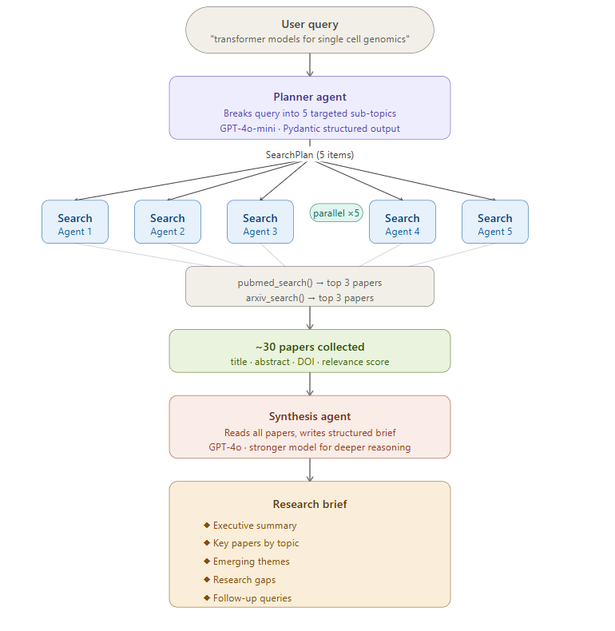
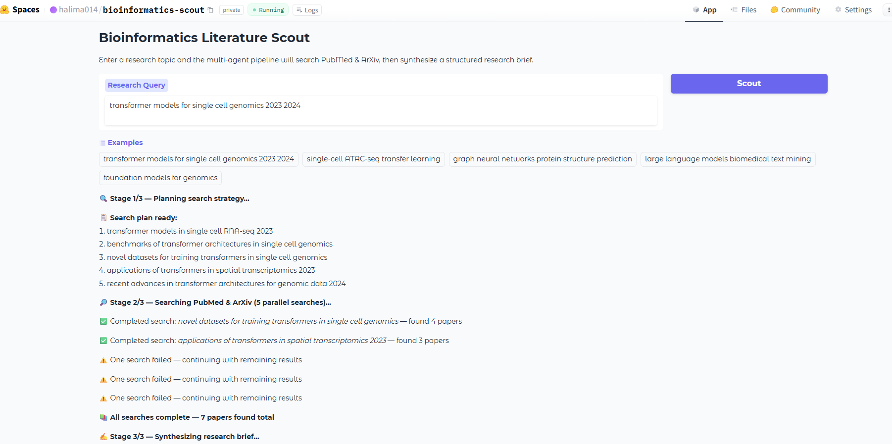
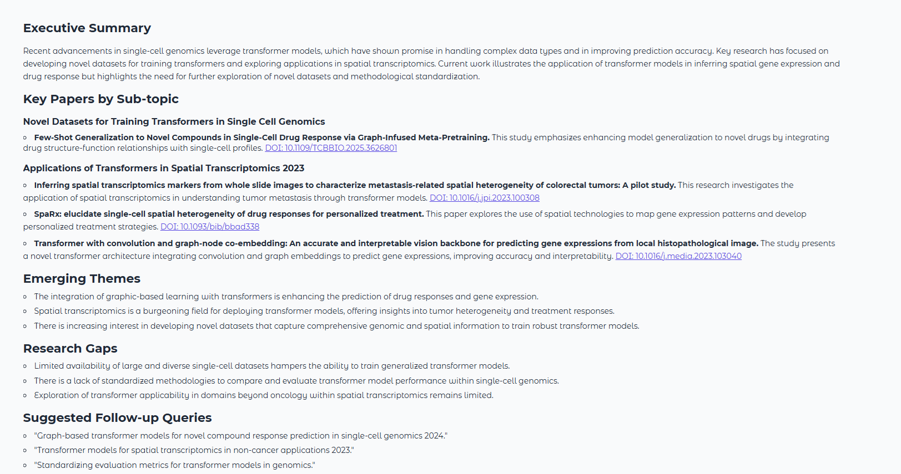

# Bioinformatics Literature Scout

A multi-agent pipeline that automates literature discovery for bioinformatics and ML research. Given a research query, the system autonomously plans a search strategy, runs parallel literature searches across PubMed and ArXiv, and synthesizes findings into a structured research brief — replicating in minutes what would take a researcher hours of manual searching.

Built with the **OpenAI Agents SDK** and deployed on **Hugging Face Spaces** via Gradio.


---

## How It Works



---

## Why "Scout"?

A scout goes ahead to survey the terrain so you don't have to. This tool scouts the **literature** — it searches PubMed and ArXiv across multiple angles of your research question, then brings back a structured summary. You skip the hours of manual searching and go straight to reading the papers that matter.

---

## Agent Roles

### 1. Planner Agent
- **Input:** Your raw research query
- **Output:** `SearchPlan` — 5 targeted sub-topic searches with reasoning
- **Model:** GPT-4o-mini
- **Purpose:** A broad query like "single-cell ATAC-seq transfer learning" is too vague for a single search. The planner decomposes it into precise queries covering methods, applications, datasets, benchmarks, and recent advances.

### 2. Search Agents (x5, parallel)
- **Input:** One search term from the plan
- **Tools:** `pubmed_search`, `arxiv_search`
- **Output:** `SearchResult` — top papers with title, abstract, DOI, relevance score
- **Model:** GPT-4o-mini
- **Purpose:** Each agent searches both PubMed and ArXiv, then selects and scores the most relevant papers. Running 5 in parallel reduces total search time from ~50s to ~10s.

### 3. Synthesis Agent
- **Input:** Original query + all collected papers
- **Output:** Structured markdown research brief
- **Model:** GPT-4o (stronger model for synthesis and reasoning)
- **Purpose:** Reads all ~30 papers, identifies patterns, and writes an actionable brief with themes, gaps, and next steps.

---

## Tools

The agents use two tools — Python functions that call real scientific APIs:

| Tool | API | What it does | Auth |
|------|-----|-------------|------|
| `pubmed_search` | NCBI Entrez (Biopython) | Searches PubMed for biomedical papers | Free — just an email |
| `arxiv_search` | ArXiv API (arxiv library) | Searches ArXiv for preprints | Free — no key needed |

---

## Tech Stack

| Component | Technology |
|-----------|-----------|
| Agent framework | OpenAI Agents SDK |
| LLM | GPT-4o, GPT-4o-mini |
| Async orchestration | Python asyncio |
| Structured outputs | Pydantic v2 |
| PubMed access | Biopython Entrez API |
| ArXiv access | arxiv Python library |
| UI | Gradio |
| Package manager | UV |

---

## Key Patterns

- **Parallel async agents** — `asyncio.create_task()` + `as_completed()` for 5 concurrent searches
- **Structured output** — `output_type=SearchPlan` forces typed, parseable responses via Pydantic
- **Tool use** — `@function_tool` wrapping real scientific APIs (PubMed, ArXiv)
- **Sequential pipeline with parallel middle stage** — plan → [search x5 parallel] → synthesize
- **Live status updates** — async generator yields progress to Gradio UI at each stage

---

## Setup

```bash
# Clone
git clone https://github.com/Mituvinci/bioinformatics-scout.git
cd bioinformatics-scout

# Install dependencies
uv sync

# Configure API keys
cp .env.example .env
# Edit .env and add:
#   OPENAI_API_KEY=sk-...
#   NCBI_EMAIL=your@email.com   (any email — no NCBI account needed)

# Run
uv run python src/app.py
```

---

## Example

**Query:** `"transformer models single cell genomics 2023 2024"`

The pipeline will:
1. Plan 5 sub-topic searches (e.g., "scBERT single cell language model", "attention mechanism gene expression")
2. Search PubMed and ArXiv in parallel for each sub-topic
3. Synthesize a brief including:
   - Executive summary of the field
   - Top papers by sub-topic with DOI links
   - Emerging themes (e.g., foundation models, multi-omics integration)
   - Research gaps
   - Suggested follow-up queries

### Example Output





---

## Deployment — Hugging Face Spaces

Deployed on Hugging Face Spaces (free CPU tier). No GPU needed — all compute happens on OpenAI's API.

API keys are stored as **Hugging Face Secrets** (Settings → Variables and Secrets), never in the code.

---

## Author

**Halima Akhter** — PhD Student, Computer Science
Specialization: ML, Deep Learning, Bioinformatics
[GitHub](https://github.com/Mituvinci)
